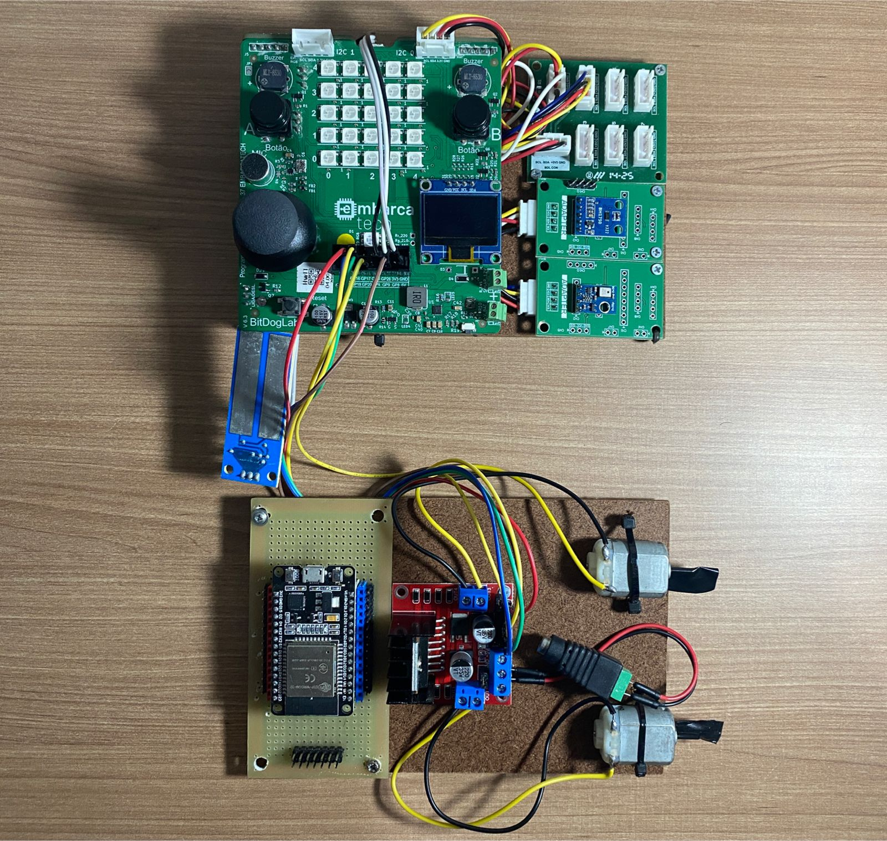

# SMART FARM

Este repositório contém o projeto de um sistema de agricultura de precisão modular, desenvolvido como parte final da fase da Residência EmbarcaTech 2025. O sistema utiliza **MQTT** para comunicação entre diferentes dispositivos, permitindo uma arquitetura flexível e escalável.

O sistema é dividido em duas partes principais:
1.  **Estação de Monitoramento (Raspberry Pi Pico W):** Responsável pela coleta de dados de sensores (umidade do solo, temperatura, etc.) e pelo controle de atuadores.
2.  **Unidade de Gerenciamento (ESP32):** Responsável por processar e visualizar dados, além de se comunicar com a estação de monitoramento.

---

## 📂 Estrutura do Repositório

O repositório está organizado para facilitar a navegação entre os projetos do Pico e do ESP32, bem como os arquivos de suporte.

* **PROJETOFINAL (Raspberry Pi Pico W)**
    * `/build`: Diretório de compilação (gerado pelo CMake).
    * `/src`: Código-fonte principal (`.c`, `.cpp`).
    * `/include`: Arquivos de cabeçalho (`.h`, `.hpp`).
    * `.vscode`: Configurações do VS Code.
    * `CMakeLists.txt`: Configuração do projeto CMake.
    * `pico_sdk_import.cmake`: Importação do SDK da Raspberry Pi.
    * `requirements.txt`: Dependências da GUI em Python.
    * `gui.py`: Script da interface gráfica de usuário.
    * `teste.py`: Script de teste.

* **ESP32_INIT (ESP32)**
    * `/src`: Código-fonte principal (`main.cpp`).
    * `/include`: Arquivos de cabeçalho.
    * `/lib`: Bibliotecas externas (se necessário).
    * `.pio`: Arquivos do PlatformIO.
    * `.vscode`: Configurações do VS Code.
    * `platformio.ini`: Configuração do PlatformIO para o ESP32.

---

## 🔗 Projetos Detalhados

### 1. Estação de Monitoramento (Raspberry Pi Pico W)

O projeto `PROJETOFINAL` é a estação de monitoramento que coleta dados de diversos sensores e os envia via MQTT. Ele também controla atuadores.

* **Sensores Utilizados:**
    * **AHT10:** Umidade e temperatura.
    * **BHT1750:** Luminosidade.
    * **GY-33:** Cor do solo (RGB).
    * **Soil Sensor:** Umidade do solo.
* **Atuadores:**
    * **Atuators.c:** Código de controle de atuadores.
* **Comunicação:**
    * **MQTT:** Utilizado para a comunicação com outros dispositivos.
* **Interface:**
    * **SSD1306 (OLED):** Exibição de informações no display.

### 2. Unidade de Gerenciamento (ESP32)

O projeto `ESP32_INIT` serve como a unidade de gerenciamento do sistema. Ele pode ser configurado para atuar como um *broker* MQTT ou como um cliente que recebe e processa os dados da estação de monitoramento do Pico.

* **Configuração:** O arquivo `config.h` é onde as configurações específicas, como credenciais de Wi-Fi e configurações de MQTT, devem ser definidas.

### 3. Interface Gráfica de Usuário (GUI)

O projeto do Pico inclui um script Python (`gui.py`) que implementa uma interface gráfica para visualizar os dados e interagir com o sistema.

* **Requisitos:** A GUI é desenvolvida com **PyQt5** e **pyqtgraph**. As dependências necessárias estão listadas no arquivo `requirements.txt`.
    * `PyQt5>=5.15.0`: Framework para a construção da interface.
    * `pyserial>=3.5`: Comunicação serial com o dispositivo.
    * `pyqtgraph>=0.13.0`: Biblioteca para plotagem de gráficos de dados.

---

## 🛠️ Requisitos e Configuração

Para compilar e rodar os projetos, siga os passos abaixo.

### 1. Configuração do Raspberry Pi Pico W

1.  **Instale o SDK do Pico:** Siga as instruções oficiais da Raspberry Pi para configurar o ambiente de desenvolvimento.
2.  **Clone o Repositório:**
    ```bash
    git clone [https://github.com/EmbarcaTech-2025/projeto-final-joaopaulo_-_gabriel-1.git](https://github.com/EmbarcaTech-2025/projeto-final-joaopaulo_-_gabriel-1.git)
    cd PROJETOFINAL
    ```
3.  **Compile o Projeto:**
    ```bash
    mkdir build
    cd build
    cmake ..
    make
    ```
4.  **Carregue o Firmware:** Conecte seu Raspberry Pi Pico W segurando o botão `BOOTSEL` e arraste o arquivo `.uf2` gerado na pasta `build` para a unidade de armazenamento do Pico.

### 2. Configuração do ESP32

1.  **Instale o PlatformIO:** Certifique-se de ter o PlatformIO instalado no seu VS Code.
2.  **Abra o Projeto:** Abra a pasta `ESP32_INIT` no VS Code. O PlatformIO detectará o projeto automaticamente.
3.  **Compile e Carregue:** Use os comandos do PlatformIO para compilar e fazer o upload do código para o ESP32.

### 3. Configuração da GUI (Opcional)

1.  **Instale as Dependências:** Certifique-se de estar na pasta do projeto do Pico e execute o comando:
    ```bash
    pip install -r requirements.txt
    ```
2.  **Execute a GUI:**
    ```bash
    python gui.py
    ```

---

## 🖼️ Mídia do Projeto



---

## 👤 Autores

* **Gabriel Martins** 
* **Joao Fernandes** 
